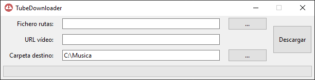

# TubeDownloader 🐱‍👤🐱‍🐉
[](https://travis-ci.org/victordpc/TubeDownloader)
[](https://www.gnu.org/licenses/gpl-3.0)

TubeDownloader is a Python application to download audio tracks of youtube video.

## Usage 🐱‍💻



* **Input** field `Fichero rutas` expects a file path with one URL per row:.
```
https://www.youtube.com/watch?v=hqbS7O9qIXE
https://www.youtube.com/watch?v=nowQC7YFBtw
https://www.youtube.com/watch?v=z9Uz1icjwrM
https://www.youtube.com/watch?v=XKcGB3HXrIg
```
* **Input** field `URL video` expects a single URL video.
* **Output** field `Carpeta destino` expects a folder path to store the audio.

To let the magic ride, must fill at least one of the input fields, select a output folder an click the `Descargar` button.

